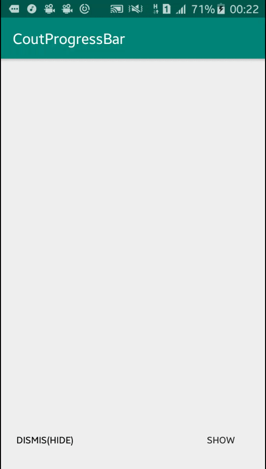

# CoutProgressBar

use easily :)

declare a private variable in activity or fragment or etc

private CoutProgressBar coutProgressBar;

in constructor or oncreate :

coutProgressBar = new CoutProgressBar(your_root_layout_id , context);

for show :
coutProgressBar.show();

for hide :
coutProgressBar.dismis();
